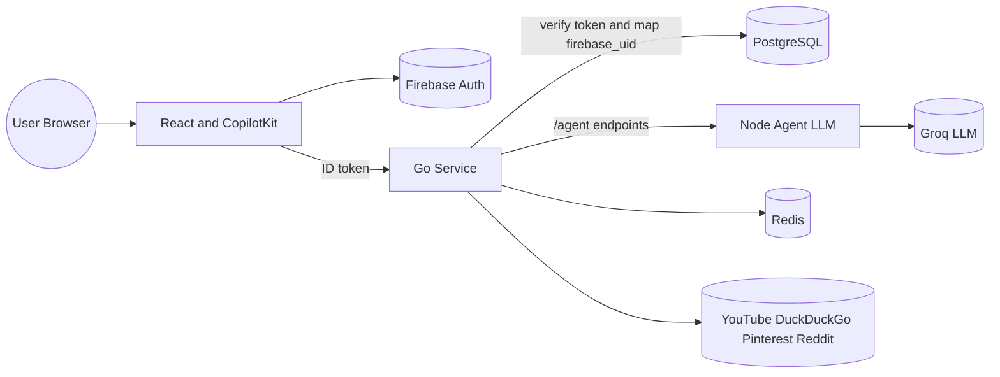

## High-level architecture (HLD)

```mermaid
flowchart LR
  User((User Browser))
  Firebase[(Firebase Auth)]

  User --> Frontend[React and CopilotKit]
  Frontend -->|ID token| GoSvc[Go Service]
  Frontend --> Firebase

  GoSvc -->|verify token and map firebase_uid| Postgres[(PostgreSQL)]

  GoSvc -->|/agent endpoints| NodeAgent[Node Agent LLM]

  GoSvc --> Redis[(Redis)]

  GoSvc --> ExtAPIs[(YouTube DuckDuckGo Pinterest Reddit)]
  NodeAgent --> Groq[(Groq LLM)]
```
