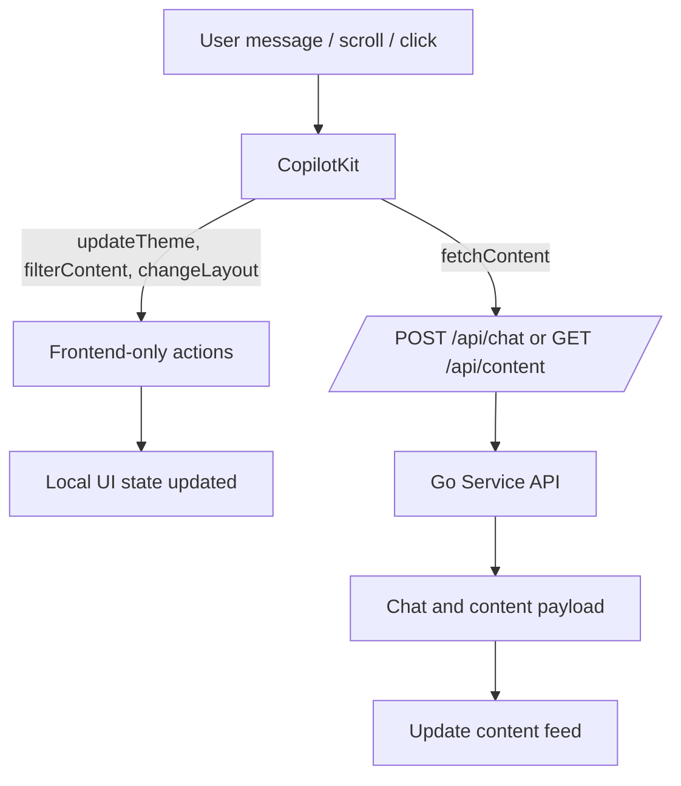

## Frontend (React + CopilotKit) LLD

```mermaid
flowchart TD
  UserMsg[User message / scroll / click]
  Copilot[CopilotKit]

  UserMsg --> Copilot

  Copilot -->|updateTheme, filterContent, changeLayout| UIActions[Frontend-only actions]
  Copilot -->|fetchContent| BackendAction[/POST /api/chat or GET /api/content/]

  UIActions --> UIState[Local UI state updated]
  BackendAction --> GoSvc[Go Service API]

  GoSvc --> CopilotResponse[Chat and content payload]
  CopilotResponse --> Feed[Update content feed]
```

