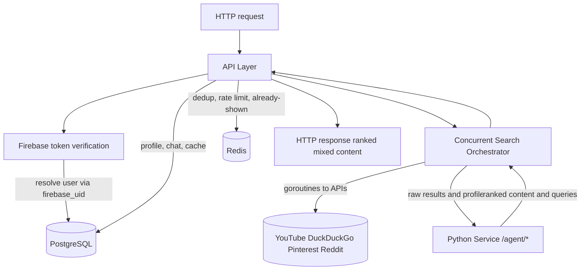

## Go service (search + orchestration) LLD

```mermaid
flowchart TD
  Req[HTTP request]
  APILayer[API Layer]
  Auth[Firebase token verification]
  Orchestrator[Concurrent Search Orchestrator]
  PyAgent[Python Service /agent/*]
  PG[(PostgreSQL)]
  RDS[(Redis)]
  ExtAPIs[(YouTube DuckDuckGo Pinterest Reddit)]

  Req --> APILayer
  APILayer --> Auth

  Auth -->|resolve user via firebase_uid| PG
  APILayer -->|profile, chat, cache| PG
  APILayer -->|dedup, rate limit, already-shown| RDS
  APILayer --> Orchestrator

  Orchestrator -->|goroutines to APIs| ExtAPIs
  Orchestrator -->|raw results and profile| PyAgent

  PyAgent -->|ranked content and queries| Orchestrator

  Orchestrator --> APILayer
  APILayer --> Resp[HTTP response ranked mixed content]
```
