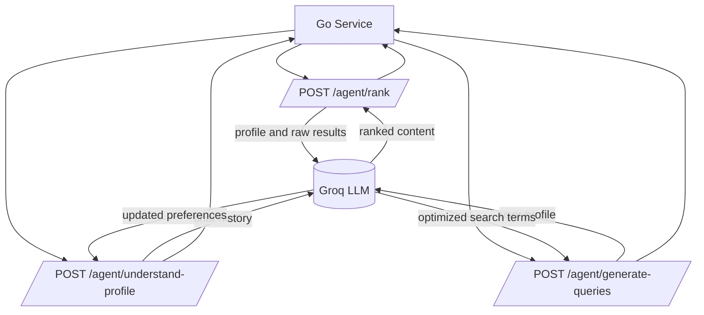

## Node agent (LLM intelligence) LLD

```mermaid
flowchart TD
  GoSvc[Go Service]
  RankEP[/POST /agent/rank/]
  ProfileEP[/POST /agent/understand-profile/]
  QueryEP[/POST /agent/generate-queries/]
  LLM[(Groq LLM)]

  GoSvc --> RankEP
  GoSvc --> ProfileEP
  GoSvc --> QueryEP

  RankEP -->|profile and raw results| LLM
  ProfileEP -->|chat history| LLM
  QueryEP -->|user profile| LLM

  LLM -->|ranked content| RankEP
  LLM -->|updated preferences| ProfileEP
  LLM -->|optimized search terms| QueryEP

  RankEP --> GoSvc
  ProfileEP --> GoSvc
  QueryEP --> GoSvc
```

