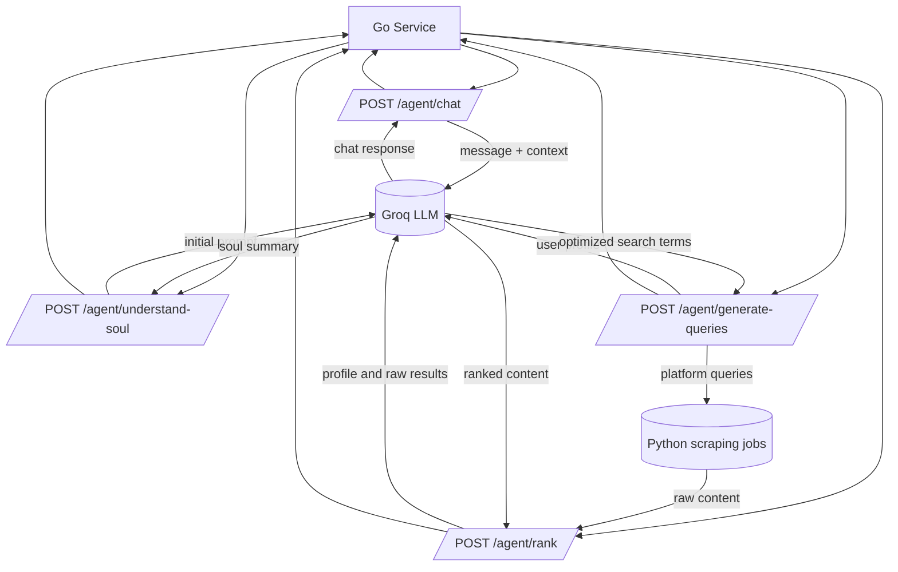

## Python service (agent + scraping) LLD

```mermaid
flowchart TD
  GoSvc[Go Service]
  ChatEP[/POST /agent/chat/]
  SoulEP[/POST /agent/understand-soul/]
  QueryEP[/POST /agent/generate-queries/]
  RankEP[/POST /agent/rank/]
  LLM[(Groq LLM)]
  Scrapers[(Python scraping jobs)]

  GoSvc --> ChatEP
  GoSvc --> SoulEP
  GoSvc --> QueryEP
  GoSvc --> RankEP

  ChatEP -->|message + context| LLM
  SoulEP -->|initial prompt| LLM
  QueryEP -->|user profile| LLM
  RankEP -->|profile and raw results| LLM

  QueryEP -->|platform queries| Scrapers
  Scrapers -->|raw content| RankEP

  LLM -->|chat response| ChatEP
  LLM -->|soul summary| SoulEP
  LLM -->|optimized search terms| QueryEP
  LLM -->|ranked content| RankEP

  ChatEP --> GoSvc
  SoulEP --> GoSvc
  QueryEP --> GoSvc
  RankEP --> GoSvc
```
