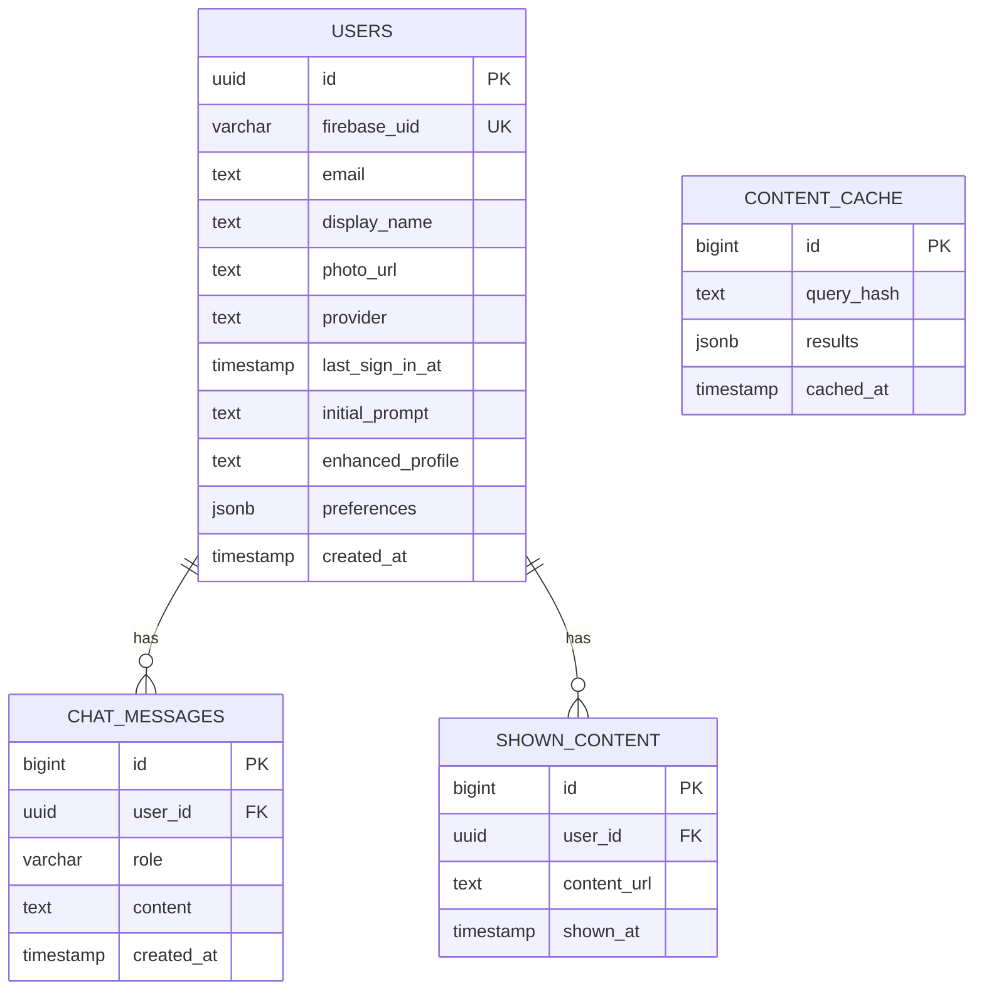

## Database schema

### Tables

```sql
-- Users
CREATE TABLE users (
    id UUID PRIMARY KEY DEFAULT gen_random_uuid(),
    firebase_uid VARCHAR(128) UNIQUE,  -- Firebase Auth UID (primary external identity)
    email TEXT,
    display_name TEXT,
    photo_url TEXT,
    provider TEXT CHECK (provider IN ('google.com', 'apple.com', NULL)),
    last_sign_in_at TIMESTAMP,
    initial_prompt TEXT NOT NULL,
    enhanced_profile TEXT,         -- Updated by LLM
    preferences JSONB,             -- Extracted preferences
    created_at TIMESTAMP DEFAULT NOW()
);

-- Chat history
CREATE TABLE chat_messages (
    id BIGSERIAL PRIMARY KEY,
    user_id UUID REFERENCES users(id),
    role VARCHAR(20),              -- 'user' or 'assistant'
    content TEXT NOT NULL,
    created_at TIMESTAMP DEFAULT NOW()
);

-- Content shown (for deduplication)
CREATE TABLE shown_content (
    id BIGSERIAL PRIMARY KEY,
    user_id UUID REFERENCES users(id),
    content_url TEXT NOT NULL,
    shown_at TIMESTAMP DEFAULT NOW(),
    UNIQUE(user_id, content_url)
);

-- Content cache (optional)
CREATE TABLE content_cache (
    id BIGSERIAL PRIMARY KEY,
    query_hash TEXT UNIQUE,
    results JSONB,
    cached_at TIMESTAMP DEFAULT NOW()
);

CREATE INDEX idx_users_firebase_uid ON users(firebase_uid);
CREATE INDEX idx_chat_user ON chat_messages(user_id, created_at);
CREATE INDEX idx_shown_content ON shown_content(user_id, shown_at);
-- Optional:
-- CREATE INDEX idx_users_email ON users(email);
```


### Schema diagram


